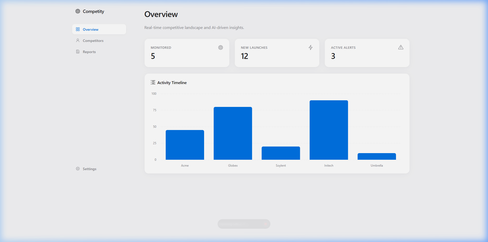
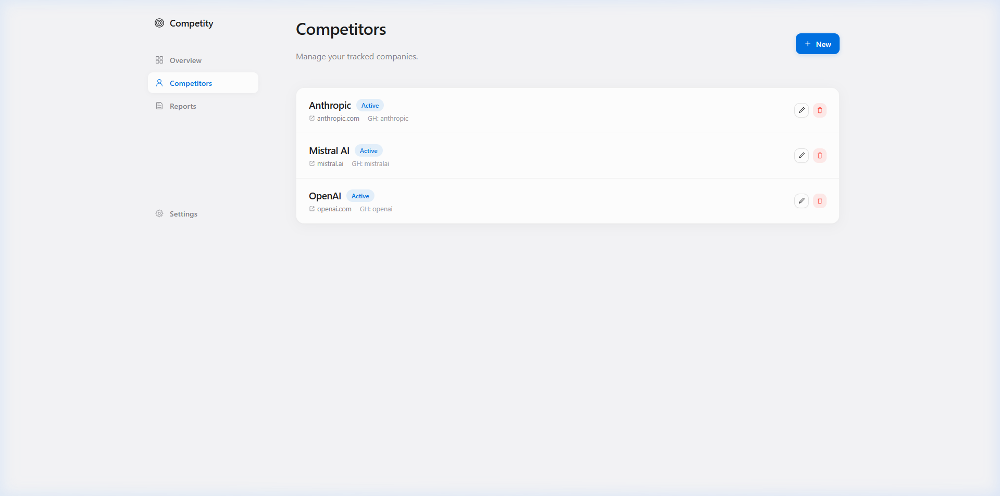
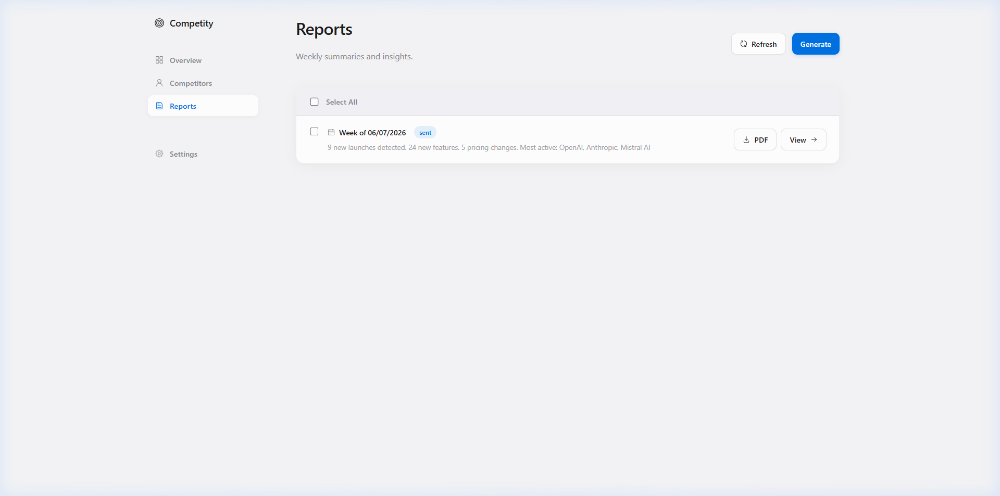

# 🕵️ Competity — Competitive Intelligence Platform

**Competity** is an automated competitive intelligence platform. It autonomously monitors your competitors across the web, analyzes the data using DeepSeek V4 (or any OpenAI-compatible endpoint like DigitalOcean), and delivers structured weekly reports to a beautiful Apple-inspired web dashboard and your Telegram inbox.



## ✨ Features

- **Automated Data Collection**: Silently scrapes and gathers data from 5 different sources:
  - 🌐 **Websites** (Playwright scrapes homepage, pricing, changelog, blog)
  - 🐙 **GitHub** (Tracks new repositories, releases, and star metrics)
  - 🚀 **Product Hunt** (Monitors new competitor product launches)
  - 📰 **HackerNews** (Tracks community sentiment and mentions)
  - 💬 **Reddit** (Searches target subreddits for brand mentions)
- **AI Analysis**: Uses **DeepSeek V4** to distill raw noise into actionable strategic insights (new launches, pricing changes, features).
- **Beautiful Dashboard**: A fast, premium React frontend built with Vite and Tailwind, designed with Apple Human Interface guidelines.
- **Telegram Delivery**: Weekly reports pushed directly to your team's Telegram chat.

---

## 📸 Screenshots

### Competitors Management
Easily add and track companies you want to monitor.


### Intelligence Reports
Browse, manage, and read AI-generated weekly executive summaries.


---

## 🏗️ Architecture

```
📡 Sources                    ⚙️ Core (FastAPI)           📬 Delivery
┌──────────┐                 ┌─────────────┐            ┌──────────┐
│ Websites │──┐              │ Collectors  │            │ Telegram │
│ GitHub   │──┤    ┌─────┐   │ Service     │────────┐   │ Bot      │
│ PH       │──┼───→│ API │──→│             │        │   └──────────┘
│ HN       │──┤    └─────┘   │ DeepSeek V4 │        │
│ Reddit   │──┘              │ Analyzer    │────────┼──→ 📊 Reports (React)
                             │             │        │
                             │ APScheduler │        │   ┌──────────┐
                             └─────────────┘        └──→│PostgreSQL│
                                                        └──────────┘
```

| Component | Technology |
|-----------|-----------|
| Frontend | React + Vite + Radix UI |
| Backend API | FastAPI + Uvicorn |
| Database | PostgreSQL 16 + async SQLAlchemy |
| AI Analysis | DeepSeek V4 (via `AsyncOpenAI`) |
| Containerization | Docker + Docker Compose |

---

## 🚀 Quick Start (Docker)

### 1. Configure environment
```bash
cp .env.example .env
```
Edit `.env` with your API keys. You can use any OpenAI-compatible provider (e.g., DigitalOcean) by setting the `DEEPSEEK_BASE_URL` and `DEEPSEEK_API_KEY`.

### 2. Start the Stack
```bash
docker-compose up -d
```
This boots up:
- **Competity Frontend** on `http://localhost:5173`
- **Competity Backend API** on `http://localhost:8000`
- **PostgreSQL** on port `5432`
- **n8n** (optional workflow automation) on `http://localhost:5678`

### 3. Open the Dashboard
Navigate to [http://localhost:5173](http://localhost:5173) to manage your competitors and generate reports.

---

## 🛠️ Local Development (without Docker)

### Backend
```bash
python -m venv .venv
source .venv/bin/activate  # Windows: .venv\Scripts\activate
pip install -e ".[dev]"
playwright install chromium

uvicorn app.main:app --reload
```

### Frontend
```bash
cd frontend
npm install
npm run dev
```

---

## 📅 Scheduling

Data collection and report generation happen automatically in the background using APScheduler. You can configure the cron timing in your `.env` file:
```env
COLLECT_CRON_HOUR=3
REPORT_CRON_DAY_OF_WEEK=mon
REPORT_CRON_HOUR=9
```

Enjoy monitoring your competition effortlessly! 🚀

---

*Made with ❤️ and 🤖 by Artsiom Beniash. Make the world a better place to live! <3*
